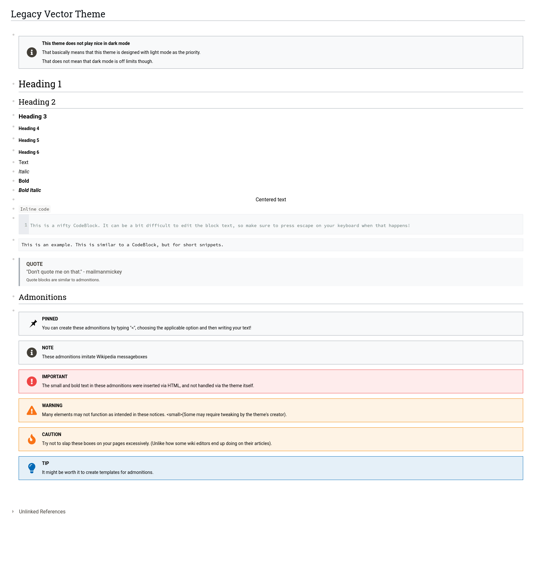

<h1 align="center">MediaWiki Legacy Vector Theme for Logseq </h1>

## Overview
This theme imitates the look and feel of Mediawiki's Legacy Vector skin. At the moment this project is in a pre-release state and will not be avaliable for download. However, regular preview updates should be avaliable until release.

At the moment this theme is light mode only. A dark mode isn't really planned, but I wouldn't mind creating it.

## Preview

