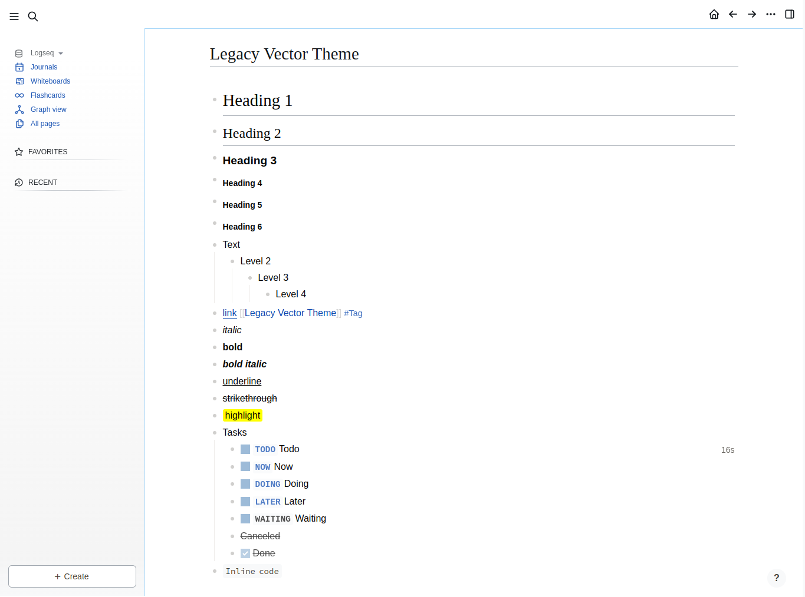
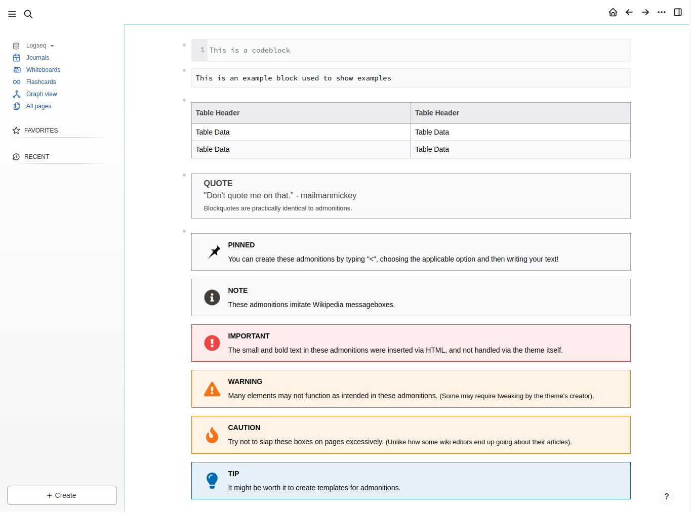

<h1 align="center">MediaWiki Legacy Vector Theme for Logseq </h1>

## Overview
This theme imitates the look and feel of Mediawiki's Legacy Vector skin. At the moment, this project is in a pre-release state and will not be avaliable for download. However, regular updates and previews should be avaliable until release.

Currently, this theme is light mode only. And while dark mode isn't really planned, I wouldn't mind creating it.

## Preview
> Screenshots show a pre-release, feature incomplete version.

